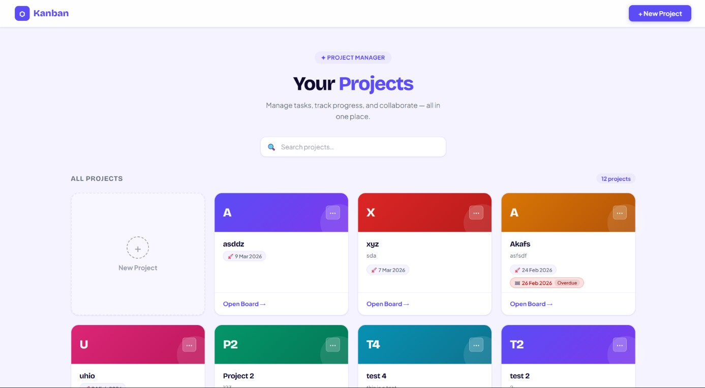
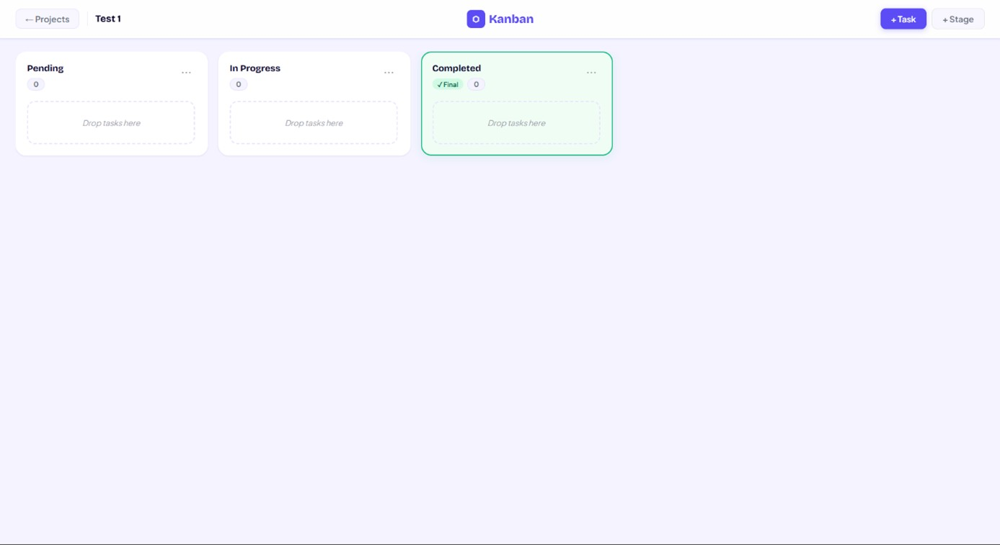
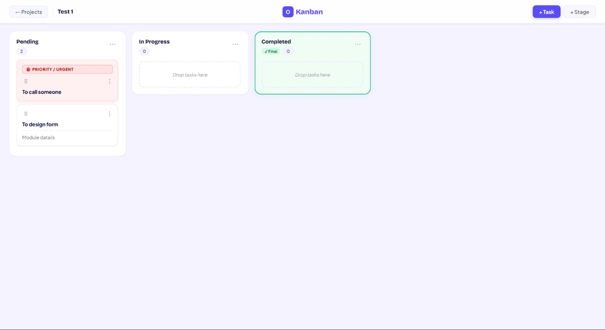
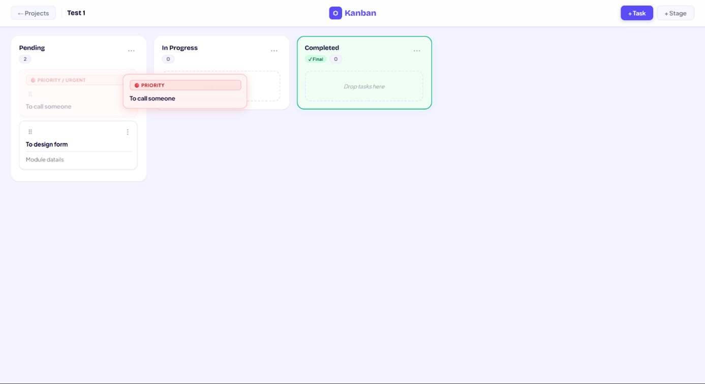
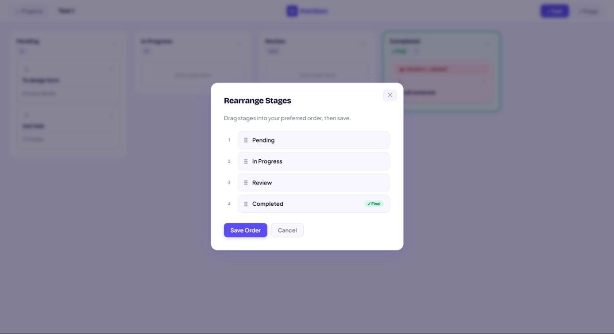
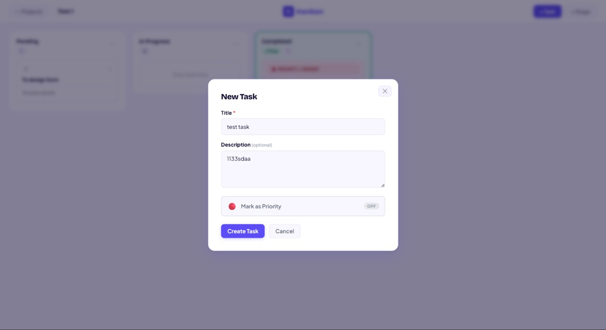

# Web-Based Kanban Project and Task Management System

A full-stack web application for visually organizing **projects, workflow stages, and tasks** using the Kanban methodology. Users can create projects, customize workflow stages, manage tasks, and move or reorder task cards with drag-and-drop.

Developed by **Manan Bhayani** as a major project during a **Web Developer Internship at Ravi Tech World** in 2026.

## Overview

The project demonstrates end-to-end full-stack web development using a **React.js frontend**, **Node.js + Express.js REST API**, and **MySQL relational database**.

The current version is a single-user project-management application focused on workflow visualization, task organization, and persistent drag-and-drop ordering.

## Key Features

- Create and view multiple projects
- Create, edit, delete, and reorder workflow stages
- Maintain stage sequence dynamically
- Create, edit, and delete tasks
- Reorder tasks within the same stage
- Move tasks between different stages
- Persist task positions and stage changes in MySQL
- Interactive drag-and-drop using DND Kit
- Modal-based forms for data entry
- Responsive Kanban board interface
- RESTful API communication using JSON
- Basic validation and error handling
- Modular frontend and backend architecture

## Tech Stack

| Layer | Technologies |
| --- | --- |
| Frontend | React.js, CSS, DND Kit |
| Backend | Node.js, Express.js |
| Database | MySQL |
| API | REST, JSON |
| UI/UX Design | Figma |
| API Testing | Postman |
| Development | Visual Studio Code |

## System Architecture

The application follows a **three-tier architecture**:

```text
Presentation Layer
React.js + CSS + DND Kit
          |
          | HTTP / JSON
          v
Application Layer
Node.js + Express.js + REST APIs
          |
          | SQL Queries
          v
Data Layer
MySQL
Projects -> Stages -> Tasks
```

This structure separates the user interface, application/business logic, and persistent data layer for better organization and maintainability.

## Main Modules

### 1. Project Management

- Create new projects
- Fetch and display existing projects
- Maintain independent workflows for each project

### 2. Stage Management

- Add workflow stages
- Edit stage names
- Delete stages
- Reorder stages using sequence numbers
- Maintain stage positions dynamically
- Maintain a completed stage in the workflow

Typical workflow:

```text
Pending -> In Progress -> Review -> Completed
```

### 3. Task Management

- Create tasks under a selected stage
- Edit task title and description
- Delete tasks
- Persist tasks in the database
- Maintain task position within each stage

### 4. Drag-and-Drop

DND Kit provides interactive task movement.

The application supports:

- Reordering tasks within the same stage
- Moving tasks between different stages
- Dynamically updating task status
- Persisting task positions after movement
- Immediate frontend state updates for responsive interaction

## Database Design

The database follows this hierarchy:

```text
Project
   |
   | 1 : Many
   v
Stage
   |
   | 1 : Many
   v
Task
```

### Project

- `project_id` - Primary Key
- `project_name`
- `description`
- `created_at`

### Stage

- `status_id` - Primary Key
- `project_id` - Foreign Key
- `status_name`
- `order_number`
- `is_completed`

### Task

- `task_id` - Primary Key
- `status_id` - Foreign Key
- `title`
- `description`
- `position`

Primary keys, foreign keys, relational mapping, and normalized schema design are used to maintain data integrity.

## REST API

The backend uses Node.js and Express.js and follows RESTful principles.

| Method | Purpose |
| --- | --- |
| `GET` | Retrieve records |
| `POST` | Create records |
| `PUT` | Update records |
| `DELETE` | Delete records |

The backend contains modular routes for:

- Projects
- Stages / project statuses
- Tasks

Task operations also handle stage changes and position updates generated by drag-and-drop actions.

## Frontend Structure

The React frontend follows a component-based structure including:

```text
App
|-- Project Page
|-- Board
|   |-- Column
|   |   `-- TaskCard
|   `-- ...
`-- Modal
```

React Hooks such as `useState` and `useEffect` are used for state management, modal visibility, API data fetching, and dynamic UI updates.

## Application Flow

```text
User Action
    |
    v
React UI
    |
    v
HTTP Request
    |
    v
Express REST API
    |
    v
MySQL Query
    |
    v
JSON Response
    |
    v
React State Update
    |
    v
UI Re-render
```

## Screenshots

| Home Screen | Kanban Board Layout |
| :---: | :---: |
|  |  |

| Kanban Board with Tasks | Task Movement |
| :---: | :---: |
|  |  |

| Stage Management | Task Creation Dialog |
| :---: | :---: |
|  |  |

## Local Setup

Follow these instructions to run the application locally on your machine.

### Prerequisites
- [Node.js](https://nodejs.org/) (v16 or higher)
- [MySQL Server](https://dev.mysql.com/downloads/mysql/)

---

### 1. Clone the Repository
```bash
git clone https://github.com/Manan0019/Kanban-Project.git
cd Kanban-Project
```

---

### 2. Database Setup
1. Open MySQL CLI or MySQL Workbench.
2. Create a new database:
   ```sql
   CREATE DATABASE kanban_db;
   ```
3. Import the tables and initial schema using the provided SQL file:
   - **Using MySQL CLI:**
     ```bash
     mysql -u root -p kanban_db < database/kanban_setup.sql
     ```
   - **Using MySQL Workbench / phpMyAdmin:** Open `database/kanban_setup.sql` and run all queries into `kanban_db`.

---

### 3. Backend Configuration & Startup
1. Navigate to the `backend` folder:
   ```bash
   cd backend
   ```
2. Install dependencies:
   ```bash
   npm install
   ```
3. Create a `.env` file inside the `backend` directory with your database connection details:
   ```env
   PORT=5000
   DB_HOST=localhost
   DB_USER=root
   DB_PASSWORD=your_mysql_password
   DB_NAME=kanban_db
   ```
   *(Replace `your_mysql_password` and `root` with your local MySQL credentials).*

4. Start the backend server:
   ```bash
   npm start
   ```

---

### 4. Frontend Setup & Startup
1. Open a new terminal tab and navigate to the `frontend` folder:
   ```bash
   cd frontend
   ```
2. Install dependencies:
   ```bash
   npm install
   ```
3. Start the React development server:
   ```bash
   npm start
   ```
4. Access the web interface at `http://localhost:3000` (or the port specified in your terminal).
```bash
npm run dev
```

## Testing

Postman was used to:

- Test API endpoints
- Validate request and response structures
- Debug backend functionality

Testing also covered frontend/backend integration, functional behavior, UI behavior, validation, error handling, and database operations.

## Challenges Addressed

Key implementation challenges included:

- Managing drag-and-drop reordering logic
- Synchronizing React state with database updates
- Maintaining correct stage sequences
- Persisting task positions after movement
- Preventing UI re-rendering conflicts

These challenges were addressed through debugging, testing, and improvements to state-management logic.

## Current Scope

The current system is a **single-user application** developed for academic demonstration and practical full-stack development experience.

The following are outside the current implementation:

- Multi-user authentication
- Role-based access control
- Real-time collaboration
- Cloud deployment
- Notification system

## Future Enhancements

- User registration and authentication
- JWT-based authentication and role-based authorization
- Multi-user project collaboration
- Task assignment
- Real-time updates using Socket.io
- Due dates and priority levels
- File attachments and comments
- Task labels and activity history
- Advanced search and filtering
- Dashboard and productivity analytics
- Improved mobile responsiveness / PWA support
- Cloud deployment and CI/CD
- Docker containerization
- Input sanitization, rate limiting, HTTPS, and API authentication

## What I Learned

This project provided hands-on experience with:

- Component-based frontend development using React.js
- React Hooks and state management
- REST API development using Node.js and Express.js
- Relational database design and MySQL integration
- Drag-and-drop interactions using DND Kit
- Frontend/backend/database integration
- Modular application architecture
- API testing using Postman
- Debugging and problem solving
- UI planning using Figma

## Author

**Manan Bhayani**

Full-Stack Web Developer | MERN Stack Developer

- GitHub: https://github.com/Manan0019
- LinkedIn: https://www.linkedin.com/in/manan-bhayani-dev/

## Acknowledgement

Developed as a major project during my **Web Developer Internship at Ravi Tech World**, Ahmedabad, Gujarat, India, as part of my B.Tech in Information Technology.

---

If you find this project useful, consider giving the repository a star.
